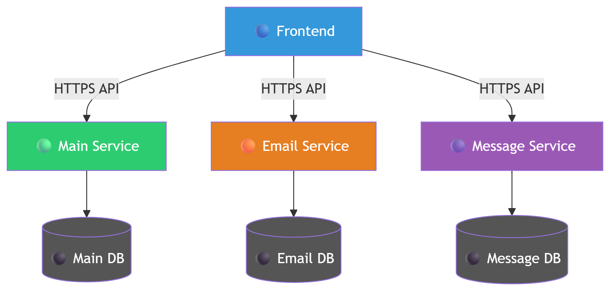
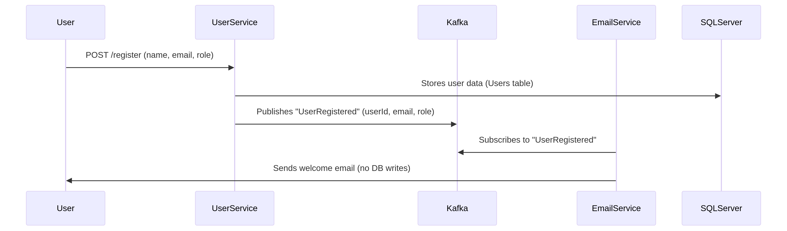
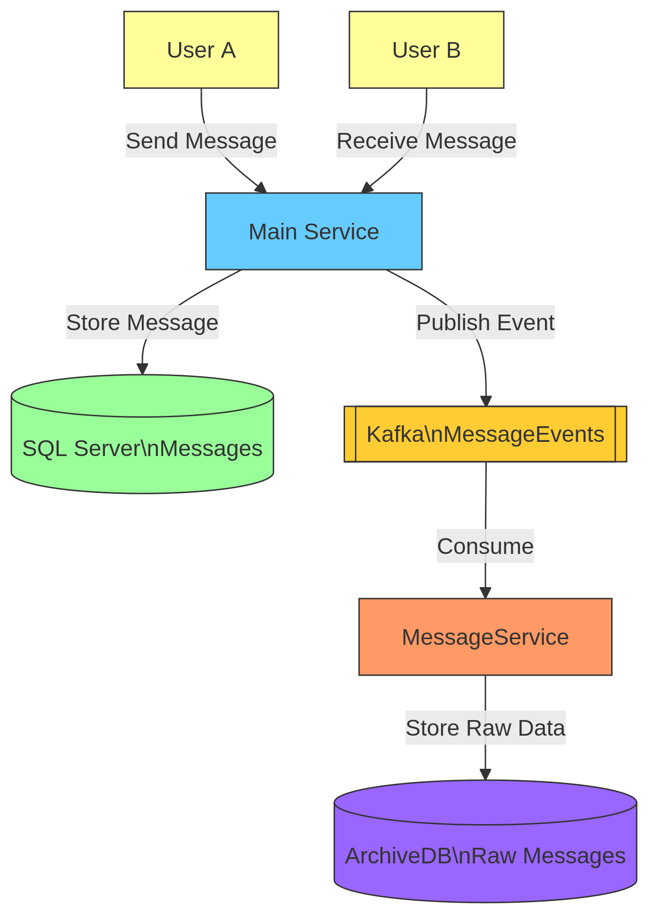

# <div>**Project Overview**</div>
- ### **This is a Property Rental Management System that connects Landlords and Tenants with an Admin overseeing the platform. The system allows Landlords to post properties, Tenants to search and apply for rentals, and Admins to manage user accounts and property listings.**
## Actors & Roles
### **1. Admin**
- Approves/Rejects new Landlord registrations.
- Approves/Rejects property posts before they go live.
- Ensures platform compliance.
### **2. Landlord**
- Manages properties (Create, Read, Update, Delete).
- Reviews rental proposals from Tenants.
-  Communicates with Tenants via messaging.
### **3. Tenant**
- Browses available properties (no login required).
- Searches properties by location, price, etc.
- Applies for rentals & uploads required documents.
- Saves favorite properties.

## The System Architecture in microservices

## **Application Services**
#### 1. Main Service
  - The brain of the system that handles all direct user actions (signups, property listings, rentals) and saves them to the database.
#### 2. Email Service

- Waits for announcements over the loudspeaker (Kafka)
- When it hears "New Guest Arrived" (UserRegistered event):
- Immediately sends a welcome email
- It keeps records in its own database
#### 3.  Message Analysis Service

- Listens to all guest conversations (MessageExchanged events)
- It keeps records in its own database

## **How to run !!!**
### **you need only to install docker and write that command**
```
docker compose up --build
```
## **Link Video**

